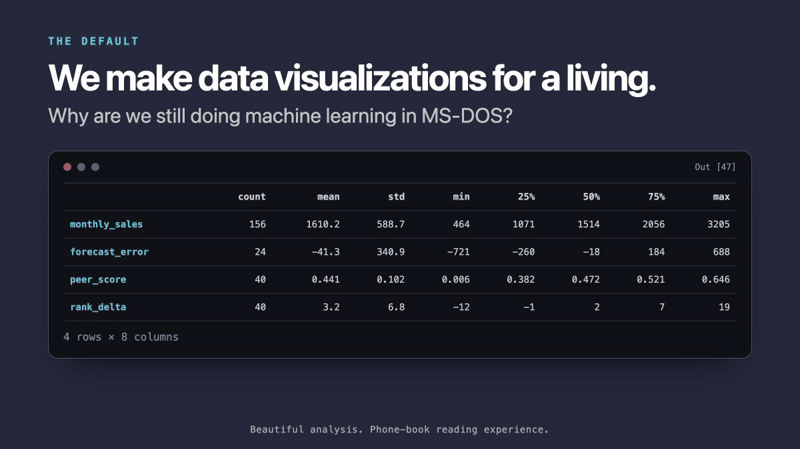

# wm-notecards 
### A living northstar



Data Science CAN look as good as Stripe or Notion.
&
df.describe() should be better.

```text
Age   Income   BMI    Visits  Claims  Premium  Score   Balance  Color   State   Segment   Churn
45    NaN      31.2   12      2       1430.52  0.91    4432.10  Green   NC      Gold      False
38    82250    NaN    4       0       982.33   0.42    1210.55  Blue    SC      Silver    False
NaN   61500    28.7   8       1       1142.01  NaN     2988.41  Red     NC      Gold      True
51    94000    34.1   NaN     4       2118.77  0.88    NaN      Green   GA      Platinum  False
29    47300    22.9   2       NaN     731.44   0.17    802.32   Blue    TN      Bronze    True
46    88100    30.5   11      3       NaN      0.95    5123.76  Green   NC      Gold      False
33    NaN      26.8   5       0       1011.29  0.38    1540.18  Red     SC      Silver    False
57    121000   35.4   15      6       2890.10  NaN     7422.63  Green   GA      Platinum  True
41    70500    NaN    7       1       1322.48  0.56    2018.90  Blue    NC      Gold      False

```

The goal is insights.

### what do you want to know everytime you look at a NUMERICAL variable?

Answer that. 

### what do you want to know everytime you look at a CATERGORICAL variable?

Answer just that. 


### You have count but no missingness?

Add it. 


### What data types are likely incorrect? 

Flag it and fix it and notify me.


## What should change?

### The quartiles are written for computers.

Add the box plot on each of them. 


### SPLASH water on your face 1x

YOUR CURIOUSITY from simply reading the COLUMN names is incredible.

```text
customer_id  age  income  balance  tenure  visits  claims  premium  score  state  segment  bmi  smoker  policy_type  plan  deductible  risk_score  churn
```

The questions are predictable.
 
The notebook should be too.

## Install

```bash
uv add "wm-notecards @ git+https://github.com/wmoore012/wm-notecards.git"
```

The shorter `uv add wm-notecards` command will be documented after the first PyPI
release; it is intentionally not claimed before that release exists.

Then make one notebook section feel like a conversation:

```python
from wm_notecards import WMTheme, init_notebook

theme = WMTheme.light()
init_notebook()
```

## What is enforced (and why)

- **Readable categories:** Dense named bar charts become horizontal; charts above 24
  categories require an explicit visual-review override.
- **Tables you can actually scan:** Neutral tables use visible alternating row shades;
  long tables stretch, scroll in both directions, and keep headers visible.
- **Preattentive hierarchy:** Answer-first titles, position, size, one restrained
  accent, zebra rows, and semantic state fills establish the reading order before a
  reader consciously decodes the values.
- **Context without collisions:** Header chips wrap instead of covering subtitles or
  chart annotations.
- **Motion with consent:** New cards arrive with a brief attention cue, hover gently,
  and respect `prefers-reduced-motion`.
- **Color sanity:** Legacy plotting defaults map onto a consistent semantic palette,
  with text, line style, or borders carrying a second channel.
- **Honest exports:** SVG, high-resolution PNG, and PDF use the styled figure
  dimensions instead of silently clipping the evidence.
- **Regression pressure:** Tests cover card shells, chart density, table overflow and
  striping, semantic colors, pictograms, formulas, icons, and static rendering.

These guarantees target the failures that are hardest to catch from code alone:
stacked category labels, clipped evidence, drifting fonts, callouts covering prose,
and notebook output that looks correct only at one width.

## Develop from source

```bash
git clone https://github.com/wmoore012/wm-notecards.git
cd wm-notecards
uv sync --extra dev --extra svg
uv run pytest
```

Style and render a figure:

```python
import plotly.express as px

from wm_notecards import WMTheme, init_notebook
from wm_notecards.charts import style_fig_wm, wm_render_figure_card

theme = WMTheme.light()
init_notebook()

fig = px.bar(
    peer_scores.head(10),
    x="score",
    y="peer_artist",
    orientation="h",
)
style_fig_wm(
    fig,
    title="The reranker creates room beyond the obvious peers",
    subtitle="Top 10 reviewed peers; higher is stronger",
    theme=theme,
)
wm_render_figure_card(
    fig,
    theme=theme,
    file_stub="peer-opportunity",
    kicker="STANDARD,08,FAIR",
    chip_text="Reviewed",
)
```

## Card grammar

| Card | Job |
|---|---|
| Question | Frame a real decision or uncertainty |
| Formula | Show the math briefly before using it |
| Evidence table | Preserve exact values |
| Evidence visual | Reveal shape, order, or relative gaps |
| Takeaway | Answer the section question loudly |
| Counterintuitive | Explain why the result is easy to overread |
| Verdict | State a bounded pass/check/fail conclusion |
| Next-think | Return the next choice to the learner |

Tables and charts are paired only when they do different jobs. A table supplies exact
values; a chart supplies visual structure. If one merely repeats the other, remove it.

## Release-quality chart behavior

The default categorical policy is intentionally opinionated:

```python
style_fig_wm(fig, title="...", theme=theme)
```

- 10–24 named categories: vertical bars become horizontal automatically.
- More than 24 named categories: rendering raises a `ValueError` and asks for top-N,
  faceting, or an explicit reviewed override.
- Custom colors stay custom; exact Matplotlib/Plotly default colors are normalized.

Use `allow_dense_categories=True` only after observing the rendered chart at desktop
and narrow widths. The full release gate is in
[docs/OPEN_SOURCE_GRAPH_CHECKLIST.md](docs/OPEN_SOURCE_GRAPH_CHECKLIST.md).
The supplied real-world examples and their current pass/fail decisions are recorded
in [docs/SCREENSHOT_AUDIT.md](docs/SCREENSHOT_AUDIT.md).

## Export for slides, articles, and sharing

```python
from wm_notecards.rendering import export_figure_wm

export_figure_wm(fig, "exports/chart.svg")       # editable vector
export_figure_wm(fig, "exports/chart.png")       # 3× share/slide default
export_figure_wm(fig, "exports/chart.pdf")       # print
```

Export only the artifact—not notebook paths, tokens, internal comments, proprietary
variable names, or private data.

## Colab builder

The portable builder embeds the package and selected project files into an initial
helper cell, clears execution state, and keeps a takeover notebook as the canonical
cell order:

```bash
uv sync --extra builder
uv run python scripts/build_colab_bootstrap.py \
  --takeover notebooks/lesson.ipynb \
  --scratch notebooks/lesson_scratch.ipynb \
  --notebook-output dist/lesson_COLAB.ipynb
```

Use `--skip-scratch` for a release notebook. Inspect the generated notebook before
sharing; embedded source is still source.

## Notecard Teacher Style skill

The distributable AI-authoring skill lives at
[`skills/notecard-teacher-style`](skills/notecard-teacher-style). It preserves the
lead-first teaching loop, careful anomaly language, visual QA requirement, and the
human-in-the-loop decision boundary.

## Development gates

```bash
uv sync --extra dev --extra svg
uv run ruff check .
uv run mypy src
uv run pytest --cov=wm_notecards --cov-report=term-missing
uv build
```

Build success is not visual proof. For browser-visible changes, observe the expected
card, chart, and table end states at desktop and narrow widths before opening a release
PR.

## Contributing

Contributions are welcome—especially new card roles, accessibility improvements,
better evidence checks, export workflows, and regression fixtures from real notebook
failures. Read [CONTRIBUTING.md](CONTRIBUTING.md) before opening a PR.

## License

MIT. See [LICENSE](LICENSE).
